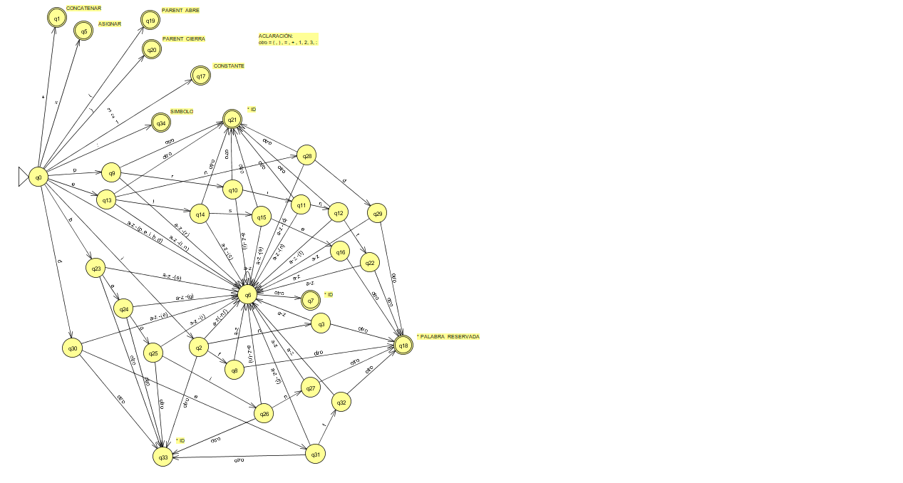

# TP Introducción 
**prototipo-de-lenguaje**
&nbsp;Un lenguaje en la materia Parseo y Generación de Código  

## Objetivo:

Se decide crear el lenguaje de programación denominado "paréntesis" el cual permita diseñar distintos programas con los cuales definir estructuras complejas entre pares de paréntesis, llamando par de parentesis a la dupla ()


## Alcance:

- El lenguaje permitirá representar cualquier tipo de estructura formada por pares de paréntesis, pudiendo contener estructuras internas hasta 4 capas
     + Ejemplos válidos: (((()))) | ()(())() | ()()()() | etc
     + Ejemplos inválidos: ))() | (() | ))(( | etc
- Los programas estaran delimitados por el iniciador "begin" y un finalizador "end".
- Contendran las palabras reservadas, if, else, begin, end, def, print.
- Las constantes serán números enteros comprendidos entre 1 y 3.
- Los identificadores deberan contener solamente letras de la a a la z en minúscula.
- Los operadores son infijos:
   + "+"  (concatenación): a + a = aa.
   + "in" (inclusión): introduce una estructura dentro de otra
   + "="  (asignación): permite almacenar expresiones en identificadores
- El operador "in" posee dos interpretaciones dependiendo del contexto en el que sea utilizado:
   + En expresiones, actúa como operador de inclusión de estructuras: A in(n) B
   + En estructuras condicionales, actúa como operador lógico de pertenencia: if A in B : expresión
- Delimitadores de estructura básica, el par "(" , ")"
- Se utilizara el simbolo ":" para indicar el comienzo de una nueva expresión
- "def" definira una nueva función de la forma: def id : expresión
- Se utilizara "print" para mostrar una expresión de la forma: print expresión


## ESPECIFICACINES LÉXICAS:

*Descripción:*
 - **begin**: *comienzo de programa*  
 - **end**: *fin de programa*  
 - **+**: *operador infijo para concatenar A con B*  
 - **in**: *operador infijo, para introducir A en B o como expresion booleana para el condicional, indica si A esta incluido en B*  
 - **=**: *operador infijo de asignación*  
 - **if**: *condicional para evaluar una condición de pertenencia*
 - **':'**: *indica el comienzo de una nueva expresión*  
 - **else**: *expresión alternativa si la condición es falsa*  
 - **id**: *variable para contener resultados de los operadores*  
 - **n**: *numero para indicar cuantas capas internas se debe ingresar*
 - **print**: *imprime en pantalla*
 - **def**: *define una función*

*Tabla TOKEN -> PATRÓN:*

| TOKEN          | PATRÓN   |
|----------------|----------|
| CONCATENAR     | +        |
| ASIGNAR        | =        |
| PARENT_ABRE    | (        |
| PARENT_CIERRA  | )        |
| CONSTANTE      | [1-3]    |
| IF             | if       |
| ELSE           | else     |
| PRINT          | print    |
| BEGIN          | begin    |
| END            | end      |
| DEF            | def      |
| IN             | in       |
| ID             | [a-z]+   |
| SIMBOLO        | :        |

*Diagráma de transiciones:*
<p align="center">
  
</p>

*Tabla de transiciones:*
<p align="center">
  
</p>

## Especificaciones sintácticas:

*GIC utilizando lexemas:*

> Prog -> begin ListaSent end  
> ListaSent -> Sent ListaSent | Sent  
> Sent -> Asig | Impr | Func  
> Asig -> Iden = Expr  
> Impr-> print Iden  
> Func -> def Iden: Expr'  
> Expr -> Expr' | if Iden in Iden : Expr' else: Expr' | () | Iden()  
> Expr' -> Valor Oper Valor  
> Valor -> Iden | Iden()   
> Oper -> + | in(Cons)  
> Cons -> 1 | 2 | 3  
> Iden -> Iden' Iden | Iden'  
> Iden'-> a | b | c | d | e | f | g | h | i | j | k | l | m | n | o | p | q | r | s | t | u | v | w | x | y | z    

*GIC utilizando tokens:*

> Prog -> BEGIN ListaSent END  
> ListaSent -> Sent ListaSent | Sent  
> Sent -> Asig | Impr | Func  
> Asig -> ID ASIGNAR Expr  
> Impr-> PRINT ID  
> Func -> DEF ID SIMBOLO Exprt  
> Expr -> Exprt | IF ID IN ID SIMBOLO Exprt ELSE SIMBOLO Exprt | PARENT_ABRE PARENT_CIERRA  | ID PARENT_ABRE PARENT_CIERRA  
> Exprt -> Valor Oper Valor  
> Valor -> ID | ID PARENT_ABRE PARENT_CIERRA   
> Oper -> CONCATENAR | IN PARENT_ABRE CONSTANTE PARENT_CIERRA  


## Especificaciones semánticas:

> A + B -> AB  
> A in B = A in(1) B -> (A)  
> A in(k) (B) -> (A in(k-1) B)  
> A in(k) (B C) -> (A in(k) B) C   
> if(+) then { A } else { B } -> A
> if(in) then{ A } else { B } -> B  
> V = A  
> V  

------------------------------------------------
------------------------------------------------

### EJEMPLO DE USO:

*Si se quisiera programar (()())(()(()))*  
 
```  
begin 
a = ()
b = a + a
c = b in(1) a
e = a in(1) a
f = a + e
g = f in(1) a
h = c + g
print h
end
```  

**Otra forma**  
```  
begin
a = ()
b = a + a
c = b in a

c // contiene (()())
-------------------
d = a in a -> (())
e = a in(2) d -> ((()))
f = a in e 

f // contiene (()(()))
----------------
g = c + f

print g // muestra en pantalla (()())(()(()))

end 

```

------------------------------------------------
------------------------------------------------

*Si se quisiera programar ()(((())))()()(((())))()()(((())))()()(((())))()()(((())))()()(((())))()()(((())))()()(((())))()*  
 
```  
begin

a = ()
b = a in a
c = if a in b: b in(2) b else: b
d = c + a
e = a + d // 
print e // muestra en pantalla ()(((())))()
e = e + e
print e // muestra en pantalla ()(((())))()()(((())))()
e = e + e
print e // muestra en pantalla ()(((())))()()(((())))()()(((())))()()(((())))()
e = e + e
print e // muestra en pantalla ()(((())))()()(((())))()()(((())))()()(((())))()()(((())))()()(((())))()()(((())))()()(((())))()

end

```
------------------------------------------------
------------------------------------------------

*Si se quisiera programar con funciones*  
 
```  
begin

a= ()
b = a in a
c = if a in b: b in(2) b else: b
d = c + a
e = a + d //
print e // muestra en pantalla ()(((())))()
def conc: e + e
f= conc() + conc() + conc() + conc()
print f // muestra en pantalla ()(((())))()()(((())))()()(((())))()()(((())))()()(((())))()()(((())))()()(((())))()()(((())))()

end

```
------------------------------------------------
------------------------------------------------

*Si se quisiera programar (())(())(())(())(())(())(())(())*  
 
```  
begin

a = ()
def inc: a in a
b = inc() + inc()
def conc: b + b
c = conc() + conc()
print c // muestra en pantalla (())(())(())(())(())(())(())(())

end

```  
## Conclusiones sobre el prototipo del lenguaje “Paréntesis”:

Voy a encarar las conclusiones hablando de cada una de las etapas y en el mismo orden en que se fueron dando y desarrollando.

*Creación del lenguaje y su alcance*:
	Fue una de las etapas más difíciles, pensar en un lenguaje sin un por qué y para qué es muy difícil que salga de cero, primero hubo que pensar y buscar un propósito para luego definir el lenguaje y esa búsqueda fue difícil, llevó su tiempo, y se me ocurrió buscar una idea entre los ejercicios de la materia anterior “Lenguajes formales”, pensé que tenía sentido encontrarla ahí y así fue, o al menos al profesor lo vio viable y dio el ok.
Desde ese entonces se comenzó con la implementación del lenguaje “Paréntesis”, un lenguaje que permita la creación de estructuras formadas por pares paréntesis “()”, donde el tipo de estructuras no tenga límite y donde cada una de estas pueda ser desarrollada de la forma en que el programador la haya pensado.

*Implementación*:
 	A medida que se fue implementando me fui encontrando con obstáculos como, cómo y hasta dónde introducir una estructura dentro de otra sin que genere un problema, por lo cual, para no generar problemas se limito a la inclusión de estructuras dentro de otras hasta solamente la tercera “capa interna” de la otra estructura, luego me daría cuenta de que sin limitaciones tampoco se generaría problema mayor, pero se decidió dejar así para limitar y no producir problemas de bucles grandes que hagan lento su ejecución.
	Otro inconveniente fue salir de que solo se podía concatenar entre variables y no entre funciones o variables y funciones, fue difícil el código en el parser, hubo que cambiar bastante lo hecho en un primer momento, pero se logró, se utilizó la ayuda de la IA para lograrlo porque en un momento no podía avanzar y me sentía frustrado por ello.

*Pruebas*:
	A medida que se fueron realizando pruebas para ver su funcionamiento me fui encontrando con muchos errores del tipo semántico que no estaban capturados para lo cual se le fueron agregando todas las salidas de error que se fueron encontrando.
	También se encontraron errores en la gramática, tuve que cambiar algunas producciones ya que no coincidían con lo esperado, sobre todo en que se puedan incluir o concatenar funciones con funciones o entre variables y funciones.

*Apreciación final*:
	Me gustó mucho esta parte de la materia, el hecho de entender como los temas de la materia, el scanner, el parser, etc., intervienen en como se crea un lenguaje, o al menos este tipo de lenguajes. Antes pensaba que era algo extremadamente lejano de lograr, que para eso se debería tener una base muy gigante de conocimiento, pero no, obviamente hay que tener mucho conocimiento y saber lo que se está haciendo antes de encarar un proyecto en serio como crear un nuevo lenguaje de programación, es divertido y lleva mucho tiempo crearlo bien, me falta conocer muchas cosas todavía sobre este tema, pero por lo aprendido y hecho me siento conforme.
